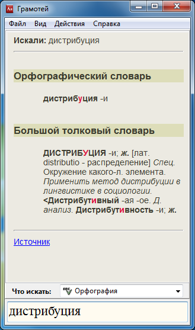

## "Грамотей."

**Приложение позволяет:**

- узнать правописание;
- найти синонимы;
- произвести морфологический анализ;
- узнать значение слова;
- найти цитаты, содержащие введенное слово.

**Используются следующие интернет-ресурсы:**

- *«Грамота.Ру»* (http://gramota.ru/);
- *«Словарь синонимов»* (https://scanwordbase.ru/synonyms.php);
- *«Морфология.Ру»* (http://www.morfologija.ru/);
- *«КартаСлов.ру»* (http://kartaslov.ru);
- «Синоним к слову» (https://sinonim-k-slovu.ru).

### Правила поиска слов
#### Использование шаблонов
Шаблон может включать в себя подстановочный символ - **звездочка** (*****):

> **Звездочка** (*****) используется для представления одной или нескольких неизвестных букв в слове, а также для представления отсутствия букв в слове в определенной позиции.

Примеры правильных запросов: **чес\*ный,** **проф\*ес\*ор,** **ветрен\*ый.**

**Использование шаблонов доступно в разделах:**

- Орфография;
- Морфология.

### Поиск слова

**Ввод слова вручную**

- Выбрать нажатием на кнопки, расположенных над полем вводе интересующий словарь.
- Ввести искомое слово в текстовое поле и нажать клавишу "Enter"

**Ввод слова из буфера обмена**

Для поиска из буфера обмена следует вызвать контекстное меню иконки в *SystemTray*  .

