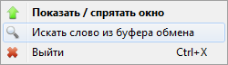

## "Грамотей."

Приложение для быстрого русскоязычного поиска по словарям:

- **Грамота.Ру** (http://gramota.ru/). 
- **Словарь синонимов** (https://scanwordbase.ru/synonyms.php).

### Правила поиска слов
#### Грамота.Ру
Поиск слова в словарях *Грамота.Ру* возможен с использованием шаблонов.

Шаблоны могут включать в себя подстановочные символы **звездочка** (*****) и **вопросительный знак** (**?**).

- **Звездочка** (*****) используется для представления одной или нескольких неизвестных букв в слове, а также для представления отсутствия букв в слове в определенной позиции.
- **Вопросительный знак** (**?**) используется для представления одной неизвестной буквы в слове.

Примеры правильных запросов: **чес\*ный,** **проф\*ес\*ор,** **ветрен\*ый.**

#### Словарь синонимов
Поиск слова в словаре синонимов возможен только при точном написании. Шаблоны не поддерживаются.

### Поиск слова

**Ввод слова вручную**

- Выбрать нажатием на кнопки, расположенных над полем вводе интересующий словарь.
- Ввести искомое слово в текстовое поле и нажать клавишу "Enter"

**Поиск слова из буфера обмена**

Для поиска из буфера обмена следует вызвать контекстное меню иконки в *SystemTray* или дважды кликнуть на значке "Грамотей"  .

